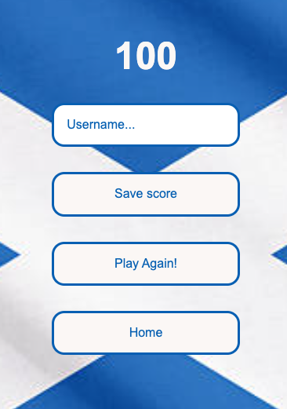
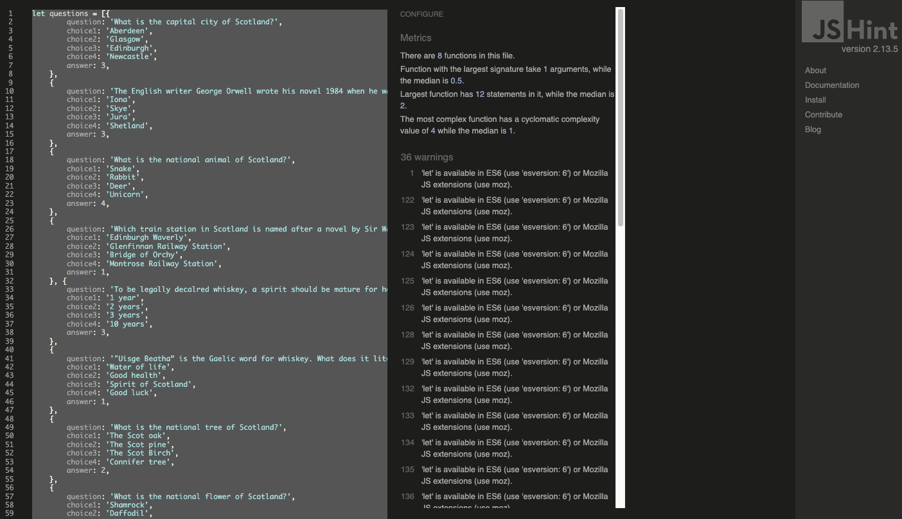
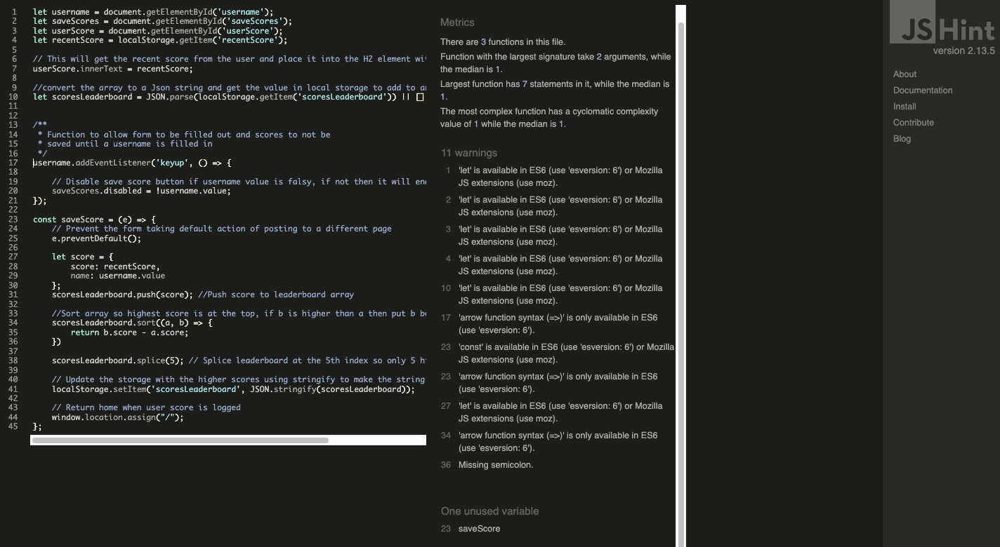
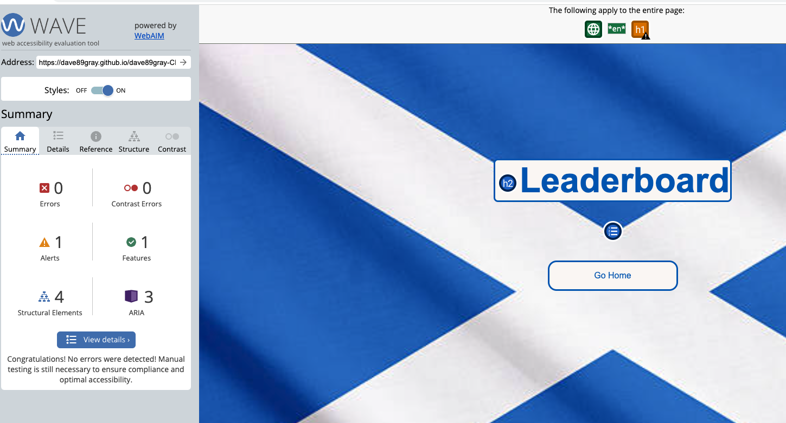
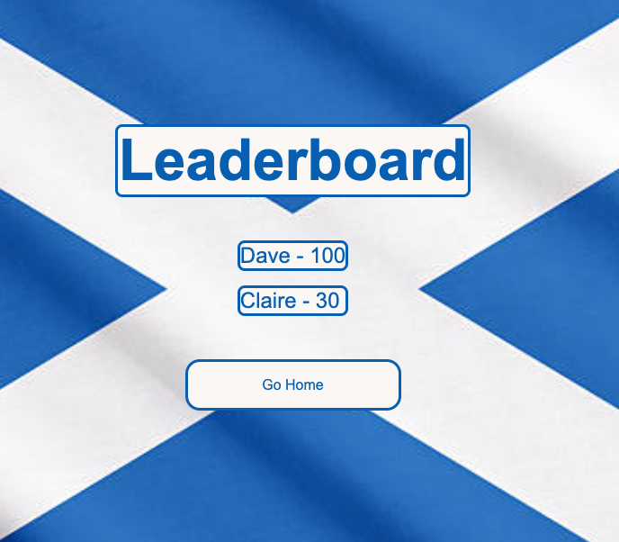

# Quizzle
(Developer: David Gray)

[Live website](https://dave89gray.github.io/dave89gray-CI_PP2_QUIZZLE/)

## Table of Contents

1.  [Project Goals](#project-goals)
    1. [User Goals](#user-goals)
    2. [Site Owner Goals](#site-owner-goals)
2.  [User Experience](#user-experience)
    1. [Target Audience](#target-audience)
    2. [User Requirements and Expectations](#user-requirements-and-expectations)
    3. [User Stories](#user-stories)
    4. [Site Owner Stories](#site-owner-stories)
3.  [Design](#design)
    1. [Design Choices](#design-choices)
    2. [Colour](#colour)
    3. [Fonts](#fonts)
    4. [Structure](#structure)
    5. [Wireframes](wireframe)
4.  [Technologies User](#technologies-used)
    1. [Languages](#languages)
    2. [Frameworks & Tools](#frameworks-&-tools)
5.  [Features](#features)
6.  [Testing](#validation)
    1. [HTML Validation](#html-validation)
    2. [CSS Validation](css-validation)
    3. [JavaScript Validation](javascript-validation)
    4. [Accessibility](#accessibility)
    5. [Performance](#performance)
    6. [Device Testing](#device-testing)
    7. [Browser Compatibility](#browser-compatability)
    8. [Testing User Stories](#testing-user-stories)
8.  [Bugs](#bugs)
9.  [Deployment](#deployment)
    1. [EmailJS](#emailjs-api)
10. [Credits](#credits)
11. [Acknowledgements](#acknowledgements)

## Project Goals
Quizzle is a fun game that aims to bring the user some happiness. The aim is to also educate the user about Scotland while they are having fun.

### User Goals
- Have fun while playing a quiz game.
- Learn more about Scotland as a nation.

### Site Owner Goals
- Create a game that the user will find entertaining and fun.
- Educate the user about Scotland as a nation.

## User Experience

### Target Audience
- People who like quizes.
- Historians.
- People who want to learn more about Scotland.

### User Requirements and Expectations
- A simple game that's easy to play.
- Links and functions that work as standard.
- Presentation that refernces Scotaland.
- A simple layout that is easy to use and navigate through.
- An easy method to leave feedback.
- Accessibility.

### User Stories
1. As a user, I want to test my knowledge of Scotland in a quiz.
2. As a user, I want to be notified if my chosen answer is correct or incorrect.
3. As a user, I want to track my progress as I answer questions.
4. As a user, I want to see my score as i progress through the quiz.
5. As a user, i want to be able to log my score and my name to the leaderboard.
6. As a user, I want to see how my score compares to others.
7. As a user, I want to be able to give feedback and get confirmation it was sucessfully delivered.

### Site Owner Stories
8. As a site owner, i want users to be able to give us feedback and make suggestions about future questions.
9. As a site owner, I want users to be able to locate us on our social media platforms.
10. As a site owner, I want users to be able to navigate about the site easily.

## Design

### Design Choices
Quizzle was designed to be proud and loud about the country Scotland. With the consistent theme of the Scotland flags, colours and references to haggis, this is supposed to leave the user feeling positive about Scotland.

### Colour
The colours of the website were chosen to match the colours of the Saltire (the Scottish flag), #FBF7F5 and #005EB8 respectively. A black colour was used on the Contact Us page so as to improve contrast and make it easier to read.

### Fonts
Arial has been chosen as the main font throughout the website so as to reduce the chances of it not functioning properly on a browser while still presenting nicely. Helvetica and sans-serif are used as back up in case Arial fails.

### Structure
The website is structured in an easy-on-the-eye way with a simple layout that is easy for the user to navigate through. The user shall find 4 different pages within the website:

- A homepage with features to navigate to different areas:
    - To the game page.
    - To the Leaderboard.
    - To the Contact-us page.
    - To the social media pages
- The game page.
- The results page.
- The leaderboard page.
- The Contact Us page.

### Wireframes

Home Page

Game Page

Results Page

Leaderboard Page

404 Page

## Technologies Used

### languages
- HTML
- CSS
- Javascript

### Frameworks and Tools
- GitHub
- Gitpod
- Balsamiq
- Favicon
- JSHint
- Lighthouse
- W3C Markup validation service
- W3C Jigsaw CSS validation service
- Wave webAim accessibility evaluation tool
- EmailJS

## Features
This site contains 6 pages and 10 features.

### Header
- The header appears on all pages except the Leaderboard page which has a "Go Home" button on it to navigate back.

### Footer
- The footer appearson all pages
- The position is always at the bottom of the screen
- User story: 9

Footer

### Home Screen
- Provides the user the ability to navigate throught the website easily.
- User story: 10

Home Screen Navigation

### Quiz Screen
- This consists of 4 sections:
    - The quiz questions
    - The multiple choice answer
    - The progress bar
    - The score counter
- User stories covered: 1, 2, 3 & 4

Game Screen

### Results Screen
- This section has different buttons to allow easy navigation
- The score will fill in dynamically
- There is a text input for the user to fill in their name
- User stories: 5, 10

Results section

### Leaderboard Screen
- This section will show the leaderboard of the game, with the highest score being at the top
- User story: 6

Leaderboard Screen

### Contact Form
- This provides the user with a way to give feedback or make suggestions
- User stories covered: 7, 8

Contact Form

### Contact Form Confirmation
- This provides the user with feedback after the form has been submitted
- User story 7

Contact Form Confirmation

### 404 Message
- This provides the user with a way to return to the game after clicking on a broken link

404 Message

## Validation

### HTML Validation
The W3C Markup Validation service was used to verify the HTML of the website. All pages passed with no errors:

Home Page

Game Page

Results Page

Leaderboard Page

Contact Us Page

### CSS Validation
The W3C Jigsaw Validation Service was used to validate the CSS of the website. The CSS passed with no errors.

Whole Page

### Javascript Validation
JSHint Static Code tool was used to validate the Javascrip code from the website. There were no major errors highlighted.

Game Javascript

Game Javascript

Results Javascript

leaderboard Javascript

Contact Us Javascript

### Accessibility
The WAVE WebAIm evaluation tool was used to ensure the website has high accessibiliy standards. There were 2 errors highlighted on the results page, however the H2 must be empty as it is dynamically filled in and the form has a button instead of a label.

Home Accessibility

Game Accessibility

Reults Accessibility

leaderboard Accessibility

Contact Us Accessibility

404 Page Accessibility

### Performace
Google Lighthouse was used in the Chrome Developers tools which tested the performance of the website.

Home Performance

Game Performance

Results Performance

Leaderboard Performance

Contact Us Performance

### Performing test on devices
The website was tested on the below devices:
- Apple MacBook Pro (15-inch, Mid 2012)
- Apple Ipad mini 4, software wersion 15.2.1
- Apple Iphone 11

The website was also tested on Google Chrome Developer Tools using the toggling option to view the layout on various devices.

### Browser Compatability
The website was tested on the following browsers:
- Google Chrome
- Mozilla Firefox
- Safari

### Testing User Stories

1. As a user, i want to test my knowledge of Scotland in a quiz.

| **Feature** | **Action** | **Expected Result** | **Actual Result** |
|-------------|------------|---------------------|-------------------|
| Buttons and links for easy navigation | Click on the features to ensure that they work | To be navigated away from the page the user is on | Works as expected |

User Story 1

2. As a user, i want to be notified if my chosen answer is correct or incorrect.

| **Feature** | **Action** | **Expected Result** | **Actual Result** |
|-------------|------------|---------------------|-------------------|
| The answer will turn green or red depending on the result and the score will update | Click the answer and see what the result is, the progress and score update automatically | Question to turn red as it is wrong | Works asa expected |

User Story 2

3. As a user, i want to track my progress as i answer the questions.

| **Feature** | **Action** | **Expected Result** | **Actual Result** |
|-------------|------------|---------------------|-------------------|
| The progress bar fills up as the questions are answered | Choose an answer to a question | The progress bar should fill up in increments | Works as expected |

User Story 3

4. As a user, i want to see my score as i progress through the quiz.

| **Feature** | **Action** | **Expected Result** | **Actual Result** |
|-------------|------------|---------------------|-------------------|
| Navigation menu | Navigate to the Projects page, locate the various examples of work undertaken | Find the examples of the company portfolio | Works as expected |

User Story 4

5. As a user, i want to be able to log my score and name to the leaderboard.

| **Feature** | **Action** | **Expected Result** | **Actual Result** |
|-------------|------------|---------------------|-------------------|
| Navigation menu | Navigate to the Projects page, locate the various examples of work undertaken | Find the examples of the company portfolio | Works as expected |

User Story 5

6. As a user, i want to see how my score compares with others.

| **Feature** | **Action** | **Expected Result** | **Actual Result** |
|-------------|------------|---------------------|-------------------|
| Navigation menu | Navigate to the Projects page, locate the various examples of work undertaken | Find the examples of the company portfolio | Works as expected |

User Story 6

7. As a user, i want to be able to give feedback and get confirmation is was successfully delivered.

| **Feature** | **Action** | **Expected Result** | **Actual Result** |
|-------------|------------|---------------------|-------------------|
| Navigation menu | Navigate to the Projects page, locate the various examples of work undertaken | Find the examples of the company portfolio | Works as expected |

User Story 7

8. As a site owner, i want users to be able to give us feedback and make suggestions about future quizes.

| **Feature** | **Action** | **Expected Result** | **Actual Result** |
|-------------|------------|---------------------|-------------------|
| Navigation menu | Navigate to the Projects page, locate the various examples of work undertaken | Find the examples of the company portfolio | Works as expected |

User Story 8

9. As a site owner, i want users to be able to locate us on our social media playforms.

| **Feature** | **Action** | **Expected Result** | **Actual Result** |
|-------------|------------|---------------------|-------------------|
| Navigation menu | Navigate to the Projects page, locate the various examples of work undertaken | Find the examples of the company portfolio | Works as expected |

User Story 9

10. As a site owner, i want users to be able to navigate the site easily.

| **Feature** | **Action** | **Expected Result** | **Actual Result** |
|-------------|------------|---------------------|-------------------|
| Navigation menu | Navigate to the Projects page, locate the various examples of work undertaken | Find the examples of the company portfolio | Works as expected |

User Story 10

